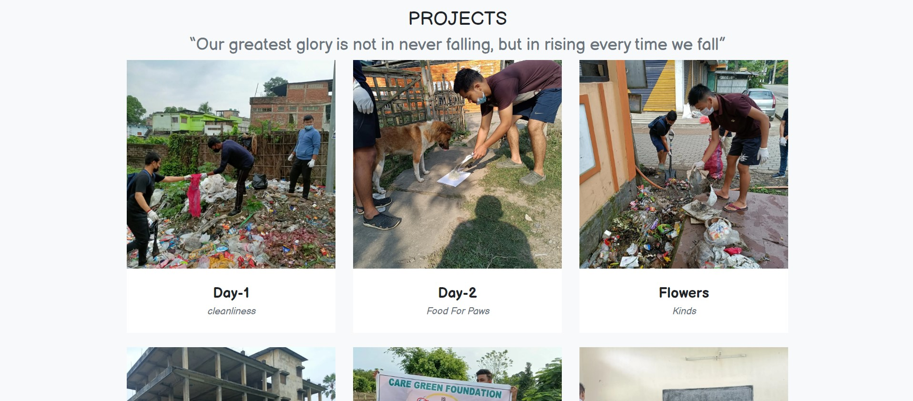

<h1><a href="https://carefreefoundation.netlify.app/project.html">Care-Free Foundation</a></h1>

<h3>Showcase My Project🛍️🎇</h3>

<figure>
  
  
   
  <figcaption>projects screenshot</figcaption>
</figure>

## Introducing Projects

This is a foundation or a charity website✨

## Inspiration

Needed a way to connect more people by this website a sistematic way to show there works, used my [portfolio's project section](https://lakshyadeepgogoi.netlify.app/#home) as inspiration.

## Getting Projects

The site should be live on `https://<your-username>.github.io/projects` or `carefreefoundation.netlify.app`

## Viewing projects

Open `index.html` in your favorite browser or visit [carefreefoundation.netlify.app](https://carefreefoundation.netlify.app/).

## How it was built

Projects was built using `HTML` `CSS` & `JavaScript`.
It will be updated soon.
Later I use Tailwind CSS and Reactjs Framework

## What I learned

- Learned about Web-Development, especially implementation of `Knowldege`.
- Flex, box-shadow and some other CSS tricks were revisited.

## What's next

You tell me!

Hit the ⭐ button if you found this useful.

## More Info

<a href="https://github.com/lakshyadeepgogoi">Source</a> | <a href="lakshyadeepgogoi/LakshyadeepGogoi123.github.io">Website</a>

